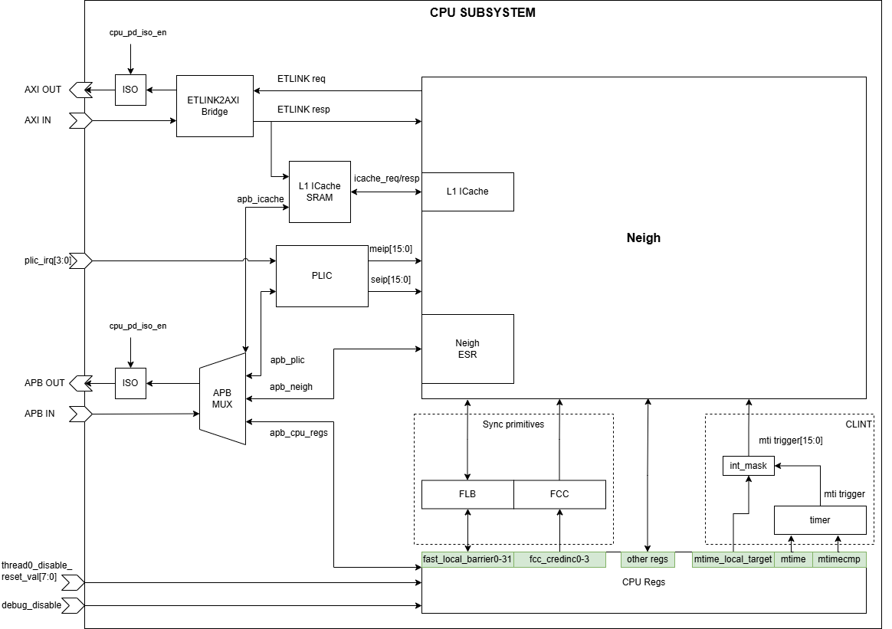

# CORE-ET RTL

This repository (on this particular branch) contains the RTL implementation and verification environment for the **CORE-ET CPU Subsystem**, a multi-core, multi-threaded RISC-V processor subsystem designed for AI inference workloads. The CPU subsystem is the major AXI4 transaction initiator of the Erbium SoC.

At the core level, each **ET-Minion** is a dual-threaded, in-order, single-issue RV64IMFC processor extended with a custom 8-lane SIMD unit. The vector unit supports packed floating-point and integer operations, transcendental instructions, and tensor instructions that accelerate machine learning workloads. Each core has a 4 KB private L1 Data Cache but shares an instruction cache with its neighbors.

Eight ET-Minion cores are grouped into an **ET-Neighborhood**, sharing instruction cache infrastructure and I/O buses. The shared instruction cache is split into two L0 caches (one per group of four cores) backed by a single 32 KB L1 ICache.

The **CPU Subsystem** integrates one ET-Neighborhood with the following system-level infrastructure:

| Component | Description |
|-----------|-------------|
| L1 ICache SRAM | 32 KB shared instruction cache, external to the Neighborhood block |
| PLIC | Platform-Level Interrupt Controller |
| CLINT | 64-bit timer (10 MHz) + software inter-processor interrupts |
| FLB | Fast Local Barriers <br> User-mode barrier counters, atomically incremented via `flb` CSR |
| FCC | Fast Credit Counters <br> Producer/consumer coordination via `fcc`/`fccnb` CSRs and `CREDINC0–3` registers |
| CPU Registers | Subsystem-level control and status registers |



For the full architecture specification and programming model see the [docs folder](https://github.com/openhwgroup/core-et/tree/erbium/docs). For an example of how this CPU Subsystem integrates into an MCU SoC see [Erbium Technical Reference Manual](https://erbium.readthedocs.io/en/latest/cpu_subsystem/).

---

## Quick Start

### 1. System packages

Install build dependencies (Ubuntu 24.04):

```bash
# RISC-V toolchain + BFD
sudo apt-get install -y \
    autoconf automake autotools-dev curl python3 python3-pip python3-tomli \
    libmpc-dev libmpfr-dev libgmp-dev gawk build-essential bison flex \
    texinfo gperf libtool patchutils bc zlib1g-dev libexpat-dev ninja-build \
    git cmake libglib2.0-dev libslirp-dev

# Verilator
sudo apt-get install -y \
    help2man perl make g++ libfl2 libfl-dev zlib1g zlib1g-dev \
    autoconf flex bison ccache

# ET Platform / cosim
sudo apt-get install -y \
    g++-13 gcc-13 pkg-config libzstd-dev libexpat1-dev binutils-dev \
    libjson-c-dev libgtest-dev libgoogle-glog-dev libgflags-dev libgmock-dev \
    lz4 liblz4-dev libboost-all-dev libcap-dev libcap2-bin \
    nlohmann-json3-dev libfmt-dev libfftw3-dev xxd
```

### 2. Install tools

Tools are installed system-wide under `/tools/`. Create and own the directory first:

```bash
sudo mkdir -p /tools
sudo chown "$USER" /tools
```

Then run each install script once per machine. Both scripts are safe to re-run, they skip work that is already done.

```bash
# RISC-V GNU toolchain (rv64imfc, bare-metal) + PIC BFD for cosim
bash dv/common/scripts/install-toolchain.sh

# Verilator v5.042
bash dv/common/scripts/install-verilator.sh
```

After installation the layout is:

| Path | Description |
|------|-------------|
| `/tools/src/riscv-gnu-toolchain/` | Cloned toolchain source. Also contains the PIC BFD build artefacts under `build-binutils-pic/` (`$RISCV_BFD_BUILD`). |
| `/tools/src/verilator/` | Cloned Verilator source. |
| `/tools/riscv-elf-toolchain/` | RISC-V toolchain install prefix (`$RISCV`). Binaries are in `bin/`. |
| `/tools/verilator/` | Verilator install prefix (`$VERILATOR_HOME`). Binaries are in `bin/`. |

### 3. Clone the repository

```bash
git clone git@github.com:openhwgroup/et-core
cd et-core
git checkout erbium
git submodule update --init --recursive
```

### 4. Set up the environment

```bash
export RISCV=/tools/riscv-elf-toolchain
source env.sh
```

Sets `REPOROOT`, `RISCV_GNU_TOOLCHAIN`, `RISCV_BFD_BUILD`, `VERILATOR_HOME`, `SYSEMU`, and prepends all tool binaries to `$PATH`.

### 5. Run a test

```bash
# Single directed test (Verilator)
et-dvrun -t erbium_playground --build_name_enable cpu_ss_vl --make --uarg verbose
```

---

## Repository Structure

| Directory | Description |
|-----------|-------------|
| `rtl/` | SystemVerilog/Verilog source for the ET-CORE CPU subsystem. There should be no sources in this directory used to build anything other than the RTL itself. Subdirectories mirror the block hierarchy: <br> 1. `cpu_subsystem/` for the top-level and interconnect <br> 2. `shire/` for the ET-Neighborhood cluster (minion core, neighborhood channel, L1 ICache) <br> 3. `memshire/` for the memory shire <br> 4. `soctop/` for SoC-level wrappers <br> 5. `inc/` for shared include files. |
| `dv/` | Verification environment for the Erbium CPU subsystem. It contains: <br> 1. The co-simulation library (`cosim/`) <br> 2. Standalone testbenches (`standalone/`) <br> 3. Directed C/assembly and SystemVerilog test suites (`tests/`) <br> 4.  (`arch_monitors/`) contains monitors hooked into the tb to extract performance events or cosimulate. <br> 5. DPI interface sources (`dpi/`), <br> 6. The `et-dvrun` test runner (`tools/etdv/`). |
| `extern/` | Third-party and platform IP maintained outside this repository, included as submodules. `et-platform/sw-sysemu` is the functional ETSOC-1 emulator used for co-simulation; `riscv-tests-fork` is the RISC-V ISA compliance test suite. |
| `test/` | --- |
| `docs/` | Documentation sources and architecture diagrams. |
| `env.sh` | Environment setup script (bash/zsh). Sources this once per shell session to export all required variables and extend `$PATH`. |

---

## Contributing

We greatly appreciate contributions from the community. To help streamline the review process, please refer to the [CONTRIBUTING.md](CONTRIBUTING.md) guidelines.

If you encounter any issues with ET-CORE CPU Subsystem, please check the issue tracker. If the problem has not already been reported, please open a new issue.
