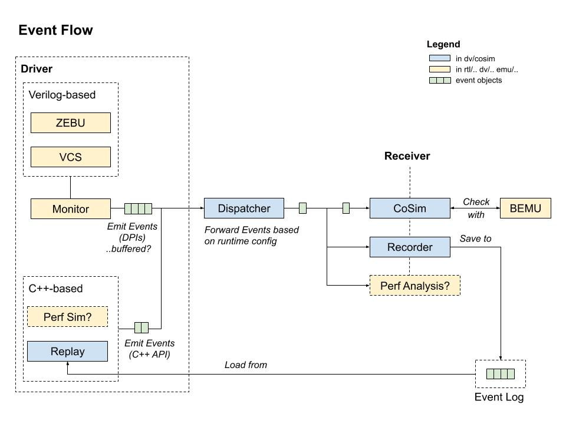

# Co-Simulation Infrastructure

## Introduction

This document describes the general outline of the  Co-Simulation infrastructure (CoSim).
It is divided in the following parts: Event Flow, Directory layout, and Development Workflow.

## Event Flow

CoSim is setup to receive and process a sequence of micro-architectural events (e.g. instruction retire).
The following figure shows an overview of the flow of an event.

Events are atomic changes at the micro-architecture level.
The driver (left side) will drive the simulation by generating a sequence of events.
In the normal simulation flow this will be VCS/Zebu and the events will be captured via DPI's.
Alternatively, we can replay a sequence of recorded events.

The events are send to the dispatcher, which will in turn forward them to whichever receiver is registered.
At this point there are two types of receivers: CoSim checker, which will check
the state changes with BEMU, and the recorder, which will save the events in
binary format.

The events are defined in [tools/cosim.evt](tools/cosim.evt).
For more information on how to define new events see [docs/events.md](docs/events.md).

### Examples of Simulation Drivers
- VCS (main tb) + Monitor(s)
- Replay Standalone
- Performance Simulator

### Examples of Receivers
- BEMU Checker
- Event Recorder

## Configuration

CoSim can be configured in three different ways:

- cosim.toml (preferred)
- arg_desc.txt
- plusargs (only available on VCS)

For more information about the available configuration options see [docs/config.md](docs/config.md).

## Record/replay functionality

**Disclaimer:** This is still under active development and may have bugs!

CoSim can record a trace of DPI events (these are basically the changes that we see in DUT).

In order to record an event trace you need to enable the event monitor (`+MONITOR=1`).
By default, this will save the DPI events collected by the ArchStateMonitor to `cosim_evt.trace`.
You can change the path the trace file using `+MONITOR_TRACE=<path>`.

    ./testme +MONITOR=1

To replay the events see [replay](replay).

    cd replay && make

This will build the replay standalone in `$REPOROOT/dv/cosim/replay/build`.
Once you add this to your `$PATH`, you will be able to replay the events:

    run-replay cosim_evt.trace        # Prints the events in a human-readable format
    run-replay -check cosim_evt.trace # Enable cosim checker (+CHECKER=1)

For more options, see `run-replay -help`.

### Coverage flow

The events can also be used to as an input for the cosim coverage tool.
The basic flow is as follows:

    run-replay -cov coverage.txt cosim_evt.trace

For more information, see [docs/coverage.md](docs/coverage.md).

## CoSim Directory Structure

The [$REPOROOT/dv/cosim](../cosim) directory is structured as follows:

### Documentation ([docs](docs))

Extra documentation and figures.

### Build directory ([build](build))

This is where all CoSim's shared libraries and executables will be built by default.
In the `et-dvrun` build process, CoSim will be built in `$BUILD_DIR/vbuild/csrc_lib`

### C++ Source directory ([src](src))

Main source files for libcosim.

Formerly `cosim.cc` (monolithic code).
Singleton (`cosim::getInstance()`), setup by the driver. 

### Support ([support](src/support))

This library contains support classes used throughout the CoSim infrastructure.
The functionality here will be loosely migrated from [$REPOROOT/test/libs](../../test/libs).

See the following Jiras:

- Config parsing (VERIF-2744)
- New logging binary library (VERIF-2570)

### Checker ([checker](src/checker))

This library integrates with BEMU ([$REPOROOT/emu/bemu](../../emu/bemu).
RTL state changes are compared with architectural simulation.

### Events ([events](src/events))

The `cosim.evt` file contains the definition of CoSim's events.
This file is parsed to generate C++ and Verilog-compatible headers.
Other files in this directory are the dispatcher source code and utilities to
serialize events.

## Other files of interest

CoSim drivers can be found under the [$REPOROOT/test](../../test) directory.

The main test bench is in [$REPOROOT/dv/dpi/evl_cpp](../../dv/dpi/evl_cpp).

Monitors are located in [$REPOROOT/test/shire/shiretop](../../test/shire/shiretop).

Common makefiles are in [$REPOROOT/test/common](../../test/common).

The old support libraries are in [$REPOROOT/test/libs](../../test/libs).

## Development Workflow

You can format the source files using `make format`.
The code style is based on the WebKit style (see [.clang-format](.clang-format)).

To regenerate the headers for `cosim.evt` run `make events`.

### Debugging CoSim

You can recompile CoSim with debug flags and AddressSanitizer enabled:

    make clean && make CPP_DEBUG=1 all

The main executable (e.g.: simv) is linked with libcosim.so, so you do not need to rebuild the whole standalone.

You will however need to preload the ASAN runtime library (since the main executable will not be linked by default).
Add this in `testme`:

    LD_PRELOAD=libasan.so.2 $ETDV_BUILD_RUNDIR/vbuild/simv [..]

You may see the following error:

    ERROR: ld.so: object 'libasan.so.2' from LD_PRELOAD cannot be preloaded: ignored.

You can try the following:

- Check whether libasan.so is in the LD_LIBRARY_PATH (should be in `/lib64`).
- Verify the version of libasan.so (e.g.: libasan.so.1, libasan.so.2, ...)
